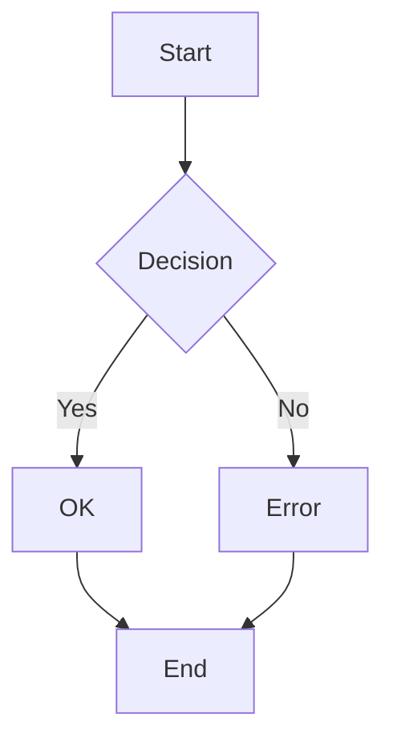

# ascii-mermaid

A Neovim plugin that renders Mermaid diagram code blocks in Markdown files as inline ASCII/Unicode art using virtual text. No browser, no external services -- just plain text diagrams rendered directly in your editor.

The rendering engine is pure TypeScript (zero dependencies) that runs via Node.js, invoked asynchronously from Lua so it never blocks the editor.

## What it looks like

A mermaid code block like this:

~~~markdown

~~~

Renders inline as:

```
┌──────────┐
│          │
│  Start   │
│          │
└─────┬────┘
      │
      ▼
┌──────────┐
│          │
│ Decision ├───No────┐
│          │         │
└─────┬────┘         │
     Yes             │
      │              │
      ▼              ▼
┌──────────┐     ┌───────┐
│          │     │       │
│    OK    │     │ Error │
│          │     │       │
└─────┬────┘     └───┬───┘
      │              │
      ▼              │
┌──────────┐         │
│          │         │
│   End    │◄────────┘
│          │
└──────────┘
```

## Supported diagram types

**Flowcharts** -- `graph TD`, `flowchart LR`, all four directions (TD, LR, BT, RL), subgraphs, 13 node shapes, edge labels, chaining, parallel edges.

**State diagrams** -- `stateDiagram-v2`, composite states, start/end pseudostates, labeled transitions.

**Sequence diagrams** -- `sequenceDiagram`, participants, actors, solid/dashed arrows, activation, blocks (loop, alt, opt, par, critical, break).

```
 ┌───────┐     ┌─────┐
 │ Alice │     │ Bob │
 └───┬───┘     └──┬──┘
     │   Hello    │
     │────────────▶
     │  Hi back   │
     ◀╌╌╌╌╌╌╌╌╌╌╌╌│
 ┌───┴───┐     ┌──┴──┐
 │ Alice │     │ Bob │
 └───────┘     └─────┘
```

**Class diagrams** -- `classDiagram`, multi-section boxes (name/attributes/methods), visibility markers, UML relationship notation (inheritance, composition, aggregation), namespaces.

**ER diagrams** -- `erDiagram`, entity boxes with typed attributes (PK/FK/UK), crow's foot cardinality notation, identifying/non-identifying relationships.

**Gantt charts** -- `gantt`, sections, task bars with date ranges, dependencies (`after`), status tags (done, active, crit, milestone).

```
                         Project Plan
  Design
    Mockups  █████████─────────────────────  01-01 -> 01-08
    Review   ────────█████─────────────────  01-08 -> 01-11
  Dev
    Coding   ────────────██████████████████  01-11 -> 01-25
```

**Pie charts** -- `pie`, horizontal bar representation with proportional widths and percentages, optional `showData` for raw values.

```
  Dogs   ██████████████████                        44.4%
  Cats   █████████████                             33.3%
  Fish   █████████                                 22.2%
```

**Timeline diagrams** -- `timeline`, vertical layout with boxed periods and tree-branching events, sections.

```
    ┌──────┐
    │ 2020 │
    └───┬──┘
        └── Event A
    ┌──────┐
    │ 2021 │
    └───┬──┘
        ├── Event B
        └── Event C
```

## Requirements

- Neovim >= 0.9
- Node.js >= 18

## Installation

The pre-built JavaScript engine is included in the repository -- no build step required.

### lazy.nvim

```lua
{
  "kais-radwan/ascii-mermaid",
  ft = "markdown",
  opts = {},
}
```

### packer.nvim

```lua
use {
  "kais-radwan/ascii-mermaid",
  config = function()
    require("ascii-mermaid").setup()
  end,
  ft = "markdown",
}
```

### vim-plug

```vim
Plug 'kais-radwan/ascii-mermaid'
```

Then in your `init.lua`:

```lua
require("ascii-mermaid").setup()
```

### Manual

Clone the repository into your Neovim packages directory:

```bash
git clone https://github.com/kais-radwan/ascii-mermaid \
  ~/.local/share/nvim/site/pack/plugins/start/ascii-mermaid
```

Then add to your config:

```lua
require("ascii-mermaid").setup()
```

## Configuration

```lua
require("ascii-mermaid").setup({
  auto = true,              -- auto-render on BufEnter and CursorHold
  use_ascii = false,        -- false = Unicode box-drawing, true = ASCII (+,-,|,>)
  debounce_ms = 500,        -- debounce delay for CursorHold re-renders
  padding_x = 2,            -- horizontal padding inside node boxes
  padding_y = 1,            -- vertical padding inside node boxes
  display_mode = "replace", -- "inline", "replace", "hybrid", or "readonly"
  hybrid_threshold = 15,    -- line count threshold for hybrid mode
})
```

### Display modes

- **inline** -- Rendered diagram appears as virtual text below the code block. Source code remains visible and editable.
- **replace** -- Diagram overlays the source code block. Move your cursor into the block to reveal the source; move away to see the diagram again.
- **hybrid** -- Uses replace mode for short blocks (under `hybrid_threshold` lines) and inline mode for longer ones.
- **readonly** -- Like replace mode, but the source code is never revealed. Use `:MermaidClear` to get back to source.

## Commands

| Command | Description |
|---|---|
| `:MermaidRender` | Toggle rendering for the current buffer |
| `:MermaidRenderAll` | Force re-render all blocks (clears cache) |
| `:MermaidClear` | Clear all rendered diagrams |
| `:MermaidStyle ascii\|unicode` | Switch between ASCII and Unicode rendering |
| `:MermaidMode inline\|replace\|hybrid\|readonly` | Switch display mode |

## Building from source

Only needed if you modify the TypeScript engine:

```bash
cd ts
npm install    # one-time: installs tsup + typescript
npm run build  # outputs to ts/dist/
```

Run tests:

```bash
make test        # build + TS unit tests + Neovim integration tests
make test-ts     # TypeScript unit tests only
make test-nvim   # Neovim integration tests only
```

## Architecture

Two-layer design:

- **TypeScript engine** (`ts/src/`) -- Pure TypeScript, zero runtime dependencies. Parses Mermaid text and renders to ASCII/Unicode strings. Flowcharts and state diagrams use a grid-based layout with A* pathfinding for edge routing. Each other diagram type has a specialized renderer.

- **Neovim Lua plugin** (`lua/ascii-mermaid/`) -- Detects mermaid code blocks via tree-sitter (with regex fallback), shells out to Node.js asynchronously via `vim.system()`, and displays results as virtual text using extmarks.

See the [docs/](docs/) directory for detailed architecture documentation.

## Acknowledgements

The core rendering engine is based on [beautiful-mermaid](https://github.com/lukilabs/beautiful-mermaid) by lukilabs. This project extends and adapts that engine with additional diagram type support, a Neovim integration layer, and multiple display modes.

## License

[MIT](LICENSE)
