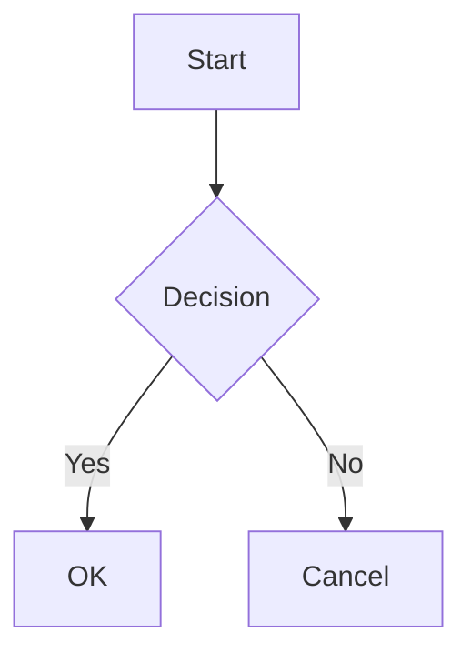
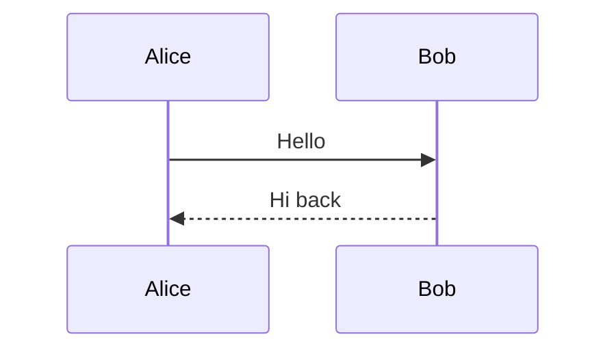
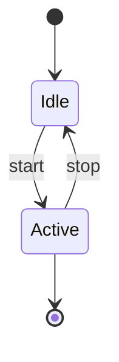
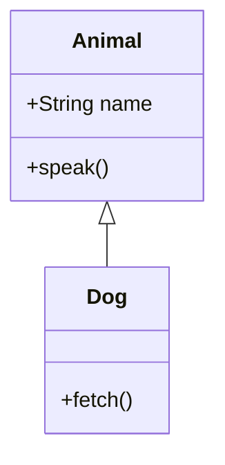
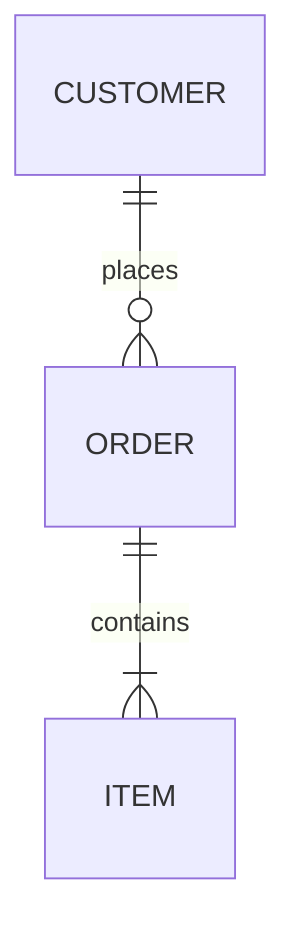

# ASCII Mermaid Demo

## Flowchart

```mermaid
graph TD
    A[Start] --> B{Decision}
    B -->|Yes| C[OK]
    B -->|No| D[Cancel]
```

## Sequence Diagram

```mermaid
sequenceDiagram
    Alice->>Bob: Hello
    Bob-->>Alice: Hi back
```

## State Diagram

```mermaid
stateDiagram-v2
    [*] --> Idle
    Idle --> Active: start
    Active --> Idle: stop
    Active --> [*]
```

## Class Diagram

```mermaid
classDiagram
    Animal <|-- Dog
    Animal: +String name
    Animal: +speak()
    Dog: +fetch()
```

## ER Diagram

```mermaid
erDiagram
    CUSTOMER ||--o{ ORDER : places
    ORDER ||--|{ ITEM : contains
```
