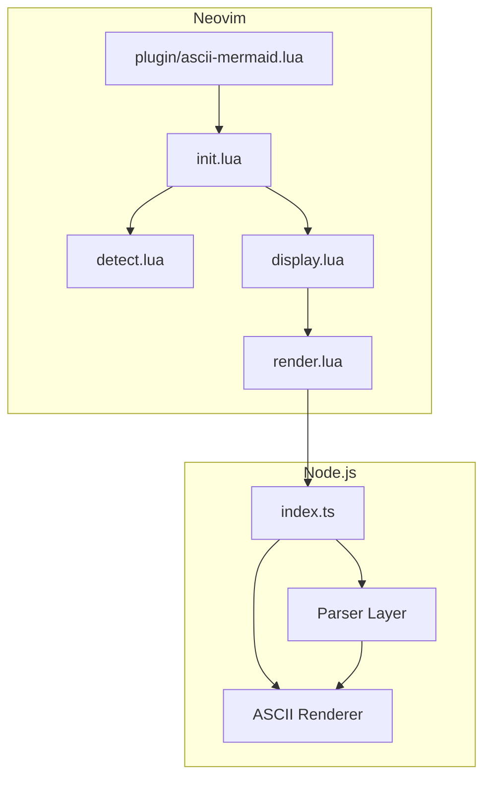
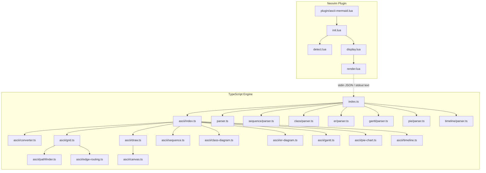
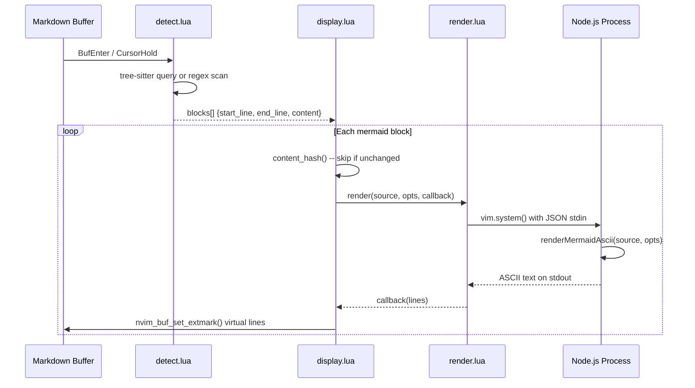

# Architecture

ascii-mermaid is a two-layer system: a **TypeScript rendering engine** that converts Mermaid syntax into ASCII/Unicode text, and a **Neovim Lua plugin** that displays the output as inline virtual text in Markdown buffers.

## High-Level Overview


The plugin detects mermaid code blocks in Markdown files, shells out to Node.js to run the TypeScript engine, and renders the ASCII output as virtual text below each block.

## Two-Layer Design



### TypeScript Engine (`ts/src/`)

Pure TypeScript, zero runtime dependencies. Parses Mermaid text and renders it to an ASCII/Unicode string. The public API is a single function:

```typescript
renderMermaidAscii(text: string, options?: AsciiRenderOptions): string
```

This is synchronous and deterministic -- same input always produces the same output.

### Neovim Plugin (`lua/ascii-mermaid/`)

Handles detection, async rendering, and display. The plugin never touches Mermaid parsing itself -- it delegates entirely to the TS engine via `vim.system()`.

## Module Map



### TypeScript modules

| Module | Responsibility |
|---|---|
| `index.ts` | Public API entry point, delegates to diagram-specific renderers |
| `parser.ts` | Regex-based parser for flowcharts and state diagrams |
| `sequence/parser.ts` | Parser for sequence diagrams |
| `class/parser.ts` | Parser for class diagrams |
| `er/parser.ts` | Parser for ER diagrams |
| `ascii/converter.ts` | Converts `MermaidGraph` to `AsciiGraph` (grid-based internal representation) |
| `ascii/grid.ts` | Node placement, column/row sizing, edge routing orchestration |
| `ascii/pathfinder.ts` | A* pathfinding for edge routes on the grid |
| `ascii/edge-routing.ts` | Determines edge start/end directions and attachment points |
| `ascii/draw.ts` | Renders boxes, lines, arrows, corners onto the 2D canvas |
| `ascii/canvas.ts` | Column-major 2D text array, junction merging, canvas utilities |
| `ascii/sequence.ts` | Self-contained sequence diagram renderer |
| `ascii/class-diagram.ts` | Self-contained class diagram renderer |
| `ascii/er-diagram.ts` | Self-contained ER diagram renderer |
| `ascii/gantt.ts` | Self-contained Gantt chart renderer |
| `ascii/pie-chart.ts` | Self-contained pie chart renderer (horizontal bars) |
| `ascii/timeline.ts` | Self-contained timeline diagram renderer |
| `gantt/parser.ts` | Parser for Gantt charts |
| `pie/parser.ts` | Parser for pie charts |
| `timeline/parser.ts` | Parser for timeline diagrams |
| `ascii/types.ts` | Type definitions for grid coords, canvas, nodes, edges, config |
| `types.ts` | Type definitions for parsed Mermaid structures |

### Lua modules

| Module | Responsibility |
|---|---|
| `plugin/ascii-mermaid.lua` | Lazy-load entry point |
| `init.lua` | `setup()`, user commands, autocmds, config merging, debounce |
| `detect.lua` | Finds mermaid code blocks via tree-sitter (regex fallback) |
| `render.lua` | Async Node.js invocation via `vim.system()`, JSON on stdin |
| `display.lua` | Extmark management, content hashing, toggle/show/clear |

## Data Flow



## Configuration

The plugin is configured via `setup()`:

```lua
require("ascii-mermaid").setup({
  auto = true,              -- auto-render on BufEnter and CursorHold
  use_ascii = false,        -- false = Unicode box-drawing, true = ASCII (+,-,|)
  debounce_ms = 500,        -- throttle CursorHold re-renders
  padding_x = 2,            -- horizontal node spacing
  padding_y = 1,            -- vertical node spacing
  display_mode = "replace", -- "inline", "replace", "hybrid", or "readonly"
  hybrid_threshold = 15,    -- line count threshold for hybrid mode
})
```

User commands:

| Command | Description |
|---|---|
| `:MermaidRender` | Toggle rendering for the current buffer |
| `:MermaidRenderAll` | Force re-render all blocks (clears cache) |
| `:MermaidClear` | Remove all virtual text |
| `:MermaidStyle ascii\|unicode` | Switch between ASCII and Unicode rendering |
| `:MermaidMode inline\|replace\|hybrid\|readonly` | Switch display mode |
