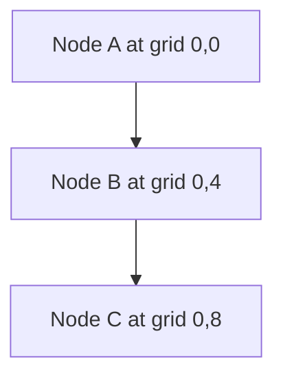
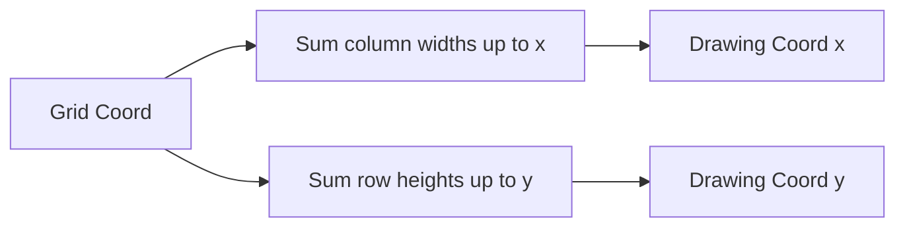
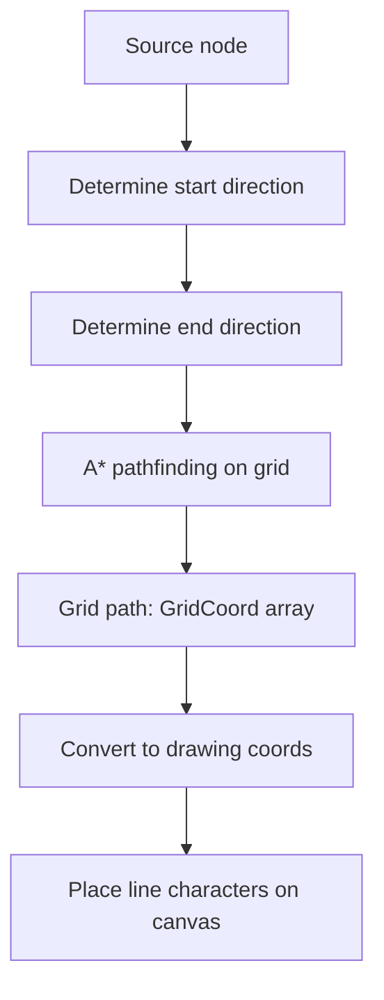
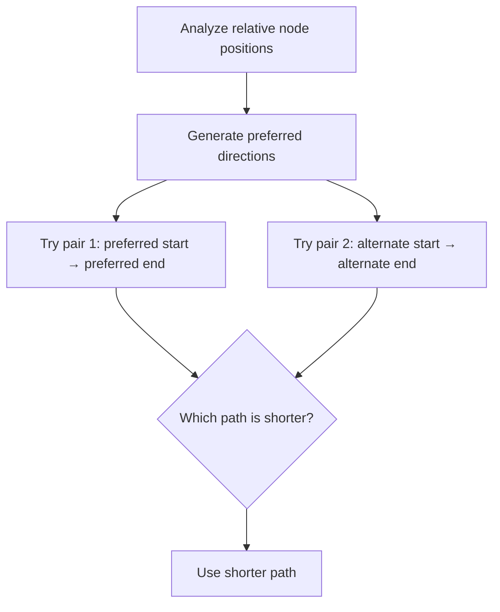

# Coordinate Systems

The flowchart/state diagram renderer uses two coordinate systems: a **logical grid** for layout and an **absolute drawing grid** for placing characters on the canvas.

## Grid Coordinates

The logical grid is where high-level layout decisions happen. Each node occupies a **3x3 block** on this grid:

```
     col 0    col 1    col 2
    ┌────────┬────────┬────────┐
row 0  │ UL     │ Up     │ UR     │
    ├────────┼────────┼────────┤
row 1  │ Left   │ Middle │ Right  │
    ├────────┼────────┼────────┤
row 2  │ LL     │ Down   │ LR     │
    └────────┴────────┴────────┘
```

The nine positions within a node's 3x3 block serve as **edge attachment points**. Edges connect to nodes at directional offsets:

| Direction | Offset (x, y) | Usage |
|---|---|---|
| Up | (1, 0) | Top-center attachment |
| Down | (1, 2) | Bottom-center attachment |
| Left | (0, 1) | Left-center attachment |
| Right | (2, 1) | Right-center attachment |
| UpperLeft | (0, 0) | Corner attachment |
| UpperRight | (2, 0) | Corner attachment |
| LowerLeft | (0, 2) | Corner attachment |
| LowerRight | (2, 2) | Corner attachment |
| Middle | (1, 1) | Node center (label position) |

## Node Placement on the Grid

Nodes are placed sequentially. The first node goes at grid position `(0, 0)`, claiming cells `(0,0)` through `(2,2)`. The next node in a top-down graph goes at `(0, 4)` -- leaving a gap of 1 grid unit between the 3x3 blocks.



```
Grid layout (TD direction):

  0  1  2  3  4  5  6  7  8  9  10  11  12
0 [  A  A  A  ]  .  .  .  .  .  .   .   .
1 [  A  A  A  ]  .  .  .  .  .  .   .   .
2 [  A  A  A  ]  .  .  .  .  .  .   .   .
3 .  .  .  .  .  .  .  .  .  .  .   .   .   ← gap
4 [  B  B  B  ]  .  .  .  .  .  .   .   .
5 [  B  B  B  ]  .  .  .  .  .  .   .   .
6 [  B  B  B  ]  .  .  .  .  .  .   .   .
7 .  .  .  .  .  .  .  .  .  .  .   .   .   ← gap
8 [  C  C  C  ]  .  .  .  .  .  .   .   .
```

When a collision occurs (e.g., two nodes want the same row in a TD graph), the second node shifts **horizontally** (perpendicular to flow).

## Drawing Coordinates

Drawing coordinates are **character-level positions** on the final text canvas. They're derived from grid coordinates by summing column widths and row heights.



**Column widths** vary based on node label length:
- Border columns (0, 2 of a node's 3x3 block): width 1 (for `│` or `|`)
- Content column (1 of the block): width = `2 * padding + labelLength`

**Row heights** vary based on content:
- Border rows (0, 2): height 1 (for `─` or `-`)
- Content row (1): height = `1 + 2 * padding`

### Example

For a node with label "Hello" and `boxBorderPadding = 1`:

```
Grid columns for this node:
  col 0: width = 1    (left border)
  col 1: width = 7    (2*1 + 5 = padding + label + padding)
  col 2: width = 1    (right border)

Grid rows:
  row 0: height = 1   (top border)
  row 1: height = 3   (1 + 2*1 = content + padding)
  row 2: height = 1   (bottom border)
```

This produces:

```
┌───────┐    ← row 0 (height 1)
│       │    ← row 1, line 1 (padding)
│ Hello │    ← row 1, line 2 (content)
│       │    ← row 1, line 3 (padding)
└───────┘    ← row 2 (height 1)
```

## Edge Routing on the Grid

Edges are routed on the **grid coordinate system** using A* pathfinding. The pathfinder:

1. Starts at the source node's attachment point (e.g., `Down` = grid offset `(1, 2)`)
2. Navigates grid cells, avoiding cells occupied by nodes
3. Ends at the target node's attachment point (e.g., `Up` = grid offset `(1, 0)`)



The A* heuristic uses **Manhattan distance** with a **corner penalty** -- when both dx and dy are non-zero relative to the goal, a penalty of 1 is added. This encourages straight lines over zigzag paths.

### Direction Selection

For each edge, the renderer tries multiple start/end direction pairs and picks the one that produces the shortest path:



For a top-down graph where B is below A:
- **Preferred**: A.Down → B.Up (straight vertical line)
- **Alternate**: A.Right → B.Left (L-shaped path)

## Canvas Coordinate System

The canvas is a **column-major 2D array**: `canvas[x][y]` where `x` is the column and `y` is the row.

```
          x=0  x=1  x=2  x=3  x=4  x=5  x=6  x=7  x=8
  y=0      ┌    ─    ─    ─    ─    ─    ─    ─    ┐
  y=1      │         H    e    l    l    o         │
  y=2      └    ─    ─    ─    ─    ─    ─    ─    ┘
  y=3                          │
  y=4                          ▼
  y=5      ┌    ─    ─    ─    ─    ─    ─    ─    ┐
  y=6      │         W    o    r    l    d         │
  y=7      └    ─    ─    ─    ─    ─    ─    ─    ┘
```

The column-major layout means iterating `canvas[x]` gives you a single column's characters from top to bottom. Converting to a string iterates row-by-row (`y` then `x`).
