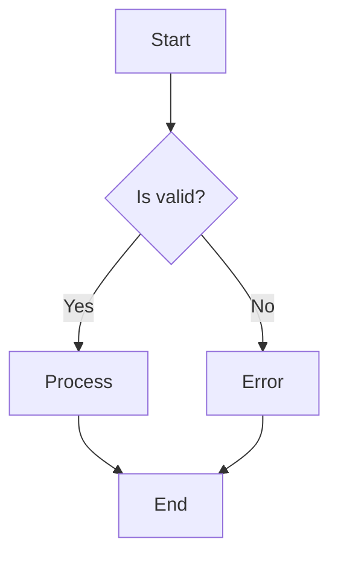
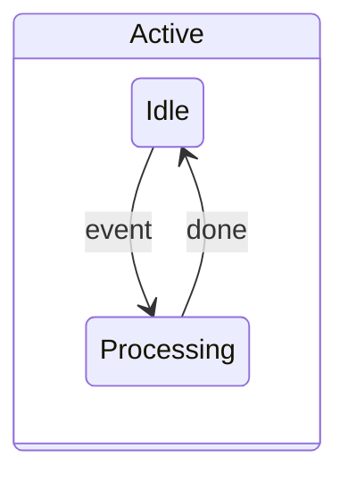
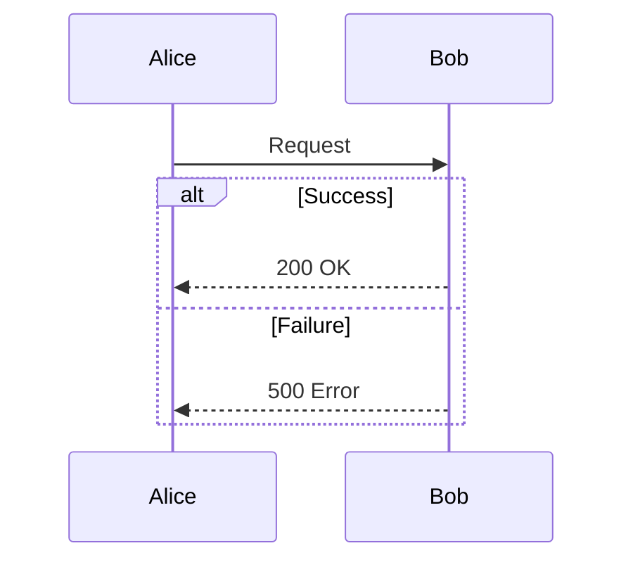
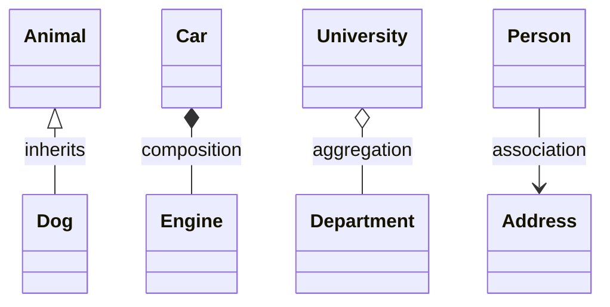
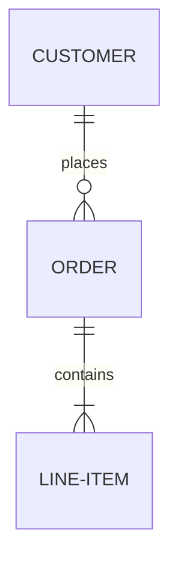
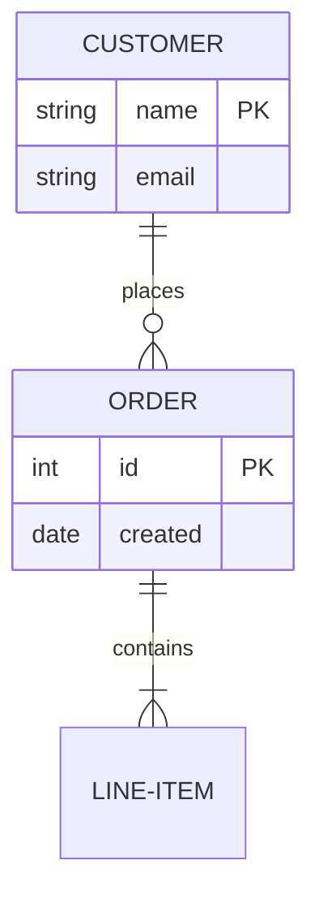
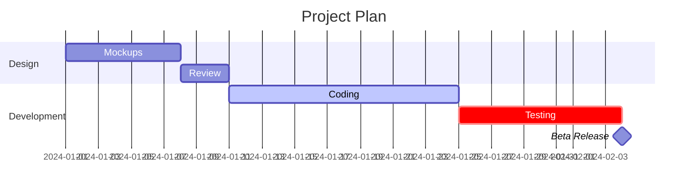
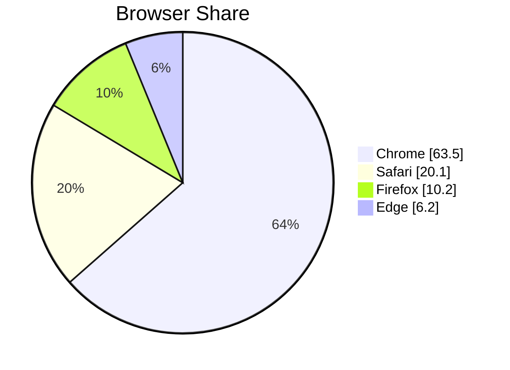
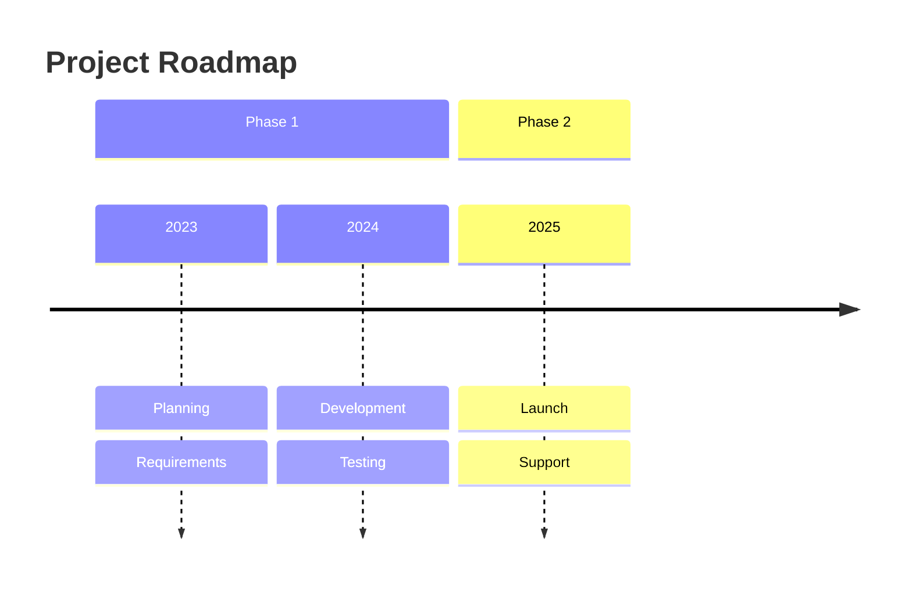

# Supported Diagram Types

ascii-mermaid supports eight Mermaid diagram types. Flowcharts and state diagrams share the grid-based rendering pipeline, while the remaining types each have specialized renderers.

## Flowcharts

**Headers:** `graph TD`, `graph LR`, `flowchart TD`, `flowchart LR`, etc.

**Directions:** `TD`/`TB` (top-down), `LR` (left-right), `BT` (bottom-top), `RL` (right-left)

### Node Shapes

| Syntax | Shape | Rendered As |
|---|---|---|
| `A[text]` | Rectangle | `┌────┐ │text│ └────┘` |
| `A(text)` | Rounded | `╭────╮ │text│ ╰────╯` |
| `A{text}` | Diamond | `◇ text ◇` |
| `A([text])` | Stadium | `(text)` pill shape |
| `A((text))` | Circle | `circular border` |
| `A[[text]]` | Subroutine | `double-bordered rectangle` |
| `A(((text)))` | Double circle | `concentric circles` |
| `A{{text}}` | Hexagon | `six-sided shape` |
| `A[(text)]` | Cylinder | `database drum` |
| `A>text]` | Asymmetric | `flag/banner shape` |
| `A[/text\]` | Trapezoid | `wider bottom` |
| `A[\text/]` | Trapezoid-alt | `wider top` |

### Edge Styles

| Syntax | Style |
|---|---|
| `A --> B` | Solid line with arrow |
| `A --- B` | Solid line, no arrow |
| `A -.-> B` | Dotted line with arrow |
| `A -.- B` | Dotted line, no arrow |
| `A ==> B` | Thick line with arrow |
| `A === B` | Thick line, no arrow |
| `A <--> B` | Bidirectional arrow |
| `A -->\|label\| B` | Edge with label |

### Features

- **Chaining:** `A --> B --> C` creates edges A-to-B and B-to-C
- **Parallel:** `A & B --> C & D` creates edges from each source to each target
- **Subgraphs:** `subgraph name ... end` with nesting support
- **Direction overrides:** `direction LR` inside a subgraph
- **Styling:** `classDef`, `style`, and `:::className` shorthand

### Example



## State Diagrams

**Header:** `stateDiagram-v2`

### Syntax

| Syntax | Meaning |
|---|---|
| `[*] --> State1` | Start transition |
| `State1 --> [*]` | End transition |
| `State1 --> State2` | Transition |
| `State1 --> State2 : label` | Labeled transition |
| `state "Description" as s1` | State with alias |
| `s1 : Description` | State description |

### Composite States



Composite states render as nested subgraphs containing their child states.

### Pseudostates

- `[*]` at the start of a transition creates a **start pseudostate** (filled circle `●`)
- `[*]` at the end creates an **end pseudostate** (bullseye `⊙`)
- Each `[*]` reference generates a unique node ID to allow multiple start/end points

## Sequence Diagrams

**Header:** `sequenceDiagram`

### Participants

```
participant A as Alice
actor B as Bob
```

`participant` renders as a box, `actor` renders as a stick figure label. Actors referenced in messages but not explicitly declared are auto-created.

### Messages

| Syntax | Arrow Style |
|---|---|
| `A->>B: text` | Solid line, filled arrowhead |
| `A-->>B: text` | Dashed line, filled arrowhead |
| `A-)B: text` | Solid line, open arrowhead |
| `A--)B: text` | Dashed line, open arrowhead |

### Activation

| Syntax | Effect |
|---|---|
| `A->>+B: text` | Activate B |
| `B-->>-A: text` | Deactivate B |

Activation is shown as a thickened section of the lifeline.

### Blocks



Supported blocks: `loop`, `alt`/`else`, `opt`, `par`/`and`, `critical`, `break`, `rect`

### Notes

```
Note left of A: text
Note right of B: text
Note over A,B: text
```

## Class Diagrams

**Header:** `classDiagram`

### Class Definitions

```
class Animal {
    +String name
    +int age
    #List~Food~ diet
    +eat(food) bool
    -sleep()
    #digest(food)* bool
}
```

Visibility markers: `+` public, `-` private, `#` protected, `~` package

### Annotations

```
class Shape {
    <<interface>>
    +draw()
}
```

Supported: `<<interface>>`, `<<abstract>>`, `<<service>>`, `<<enumeration>>`

### Relationships



| Syntax | Relationship | Marker |
|---|---|---|
| `A <\|-- B` | Inheritance | Hollow triangle `△` |
| `A *-- B` | Composition | Filled diamond `◆` |
| `A o-- B` | Aggregation | Hollow diamond `◇` |
| `A --> B` | Association | Arrow `→` |
| `A ..> B` | Dependency | Dashed arrow |
| `A ..\|> B` | Realization | Dashed + hollow triangle |

### Cardinality

```
Customer "1" --> "*" Order
```

### Namespaces

```
namespace com.example {
    class Foo
    class Bar
}
```

## ER Diagrams

**Header:** `erDiagram`

### Entities

```
CUSTOMER {
    string name PK
    string email UK
    int age
}
```

Attribute constraints: `PK` (primary key), `FK` (foreign key), `UK` (unique key)

### Relationships



### Cardinality Notation

| Syntax | Meaning | Crow's Foot |
|---|---|---|
| `\|\|` | Exactly one | `║` |
| `o\|` | Zero or one | `o║` |
| `}\|` | One or more | `╟` |
| `o{` | Zero or more | `o╟` |

### Line Styles

| Syntax | Meaning |
|---|---|
| `--` | Identifying (solid line) |
| `..` | Non-identifying (dashed line) |

### Example



## Gantt Charts

**Header:** `gantt`

### Directives

| Directive | Purpose |
|---|---|
| `title <text>` | Chart title (centered above tasks) |
| `dateFormat <format>` | Date format (default: `YYYY-MM-DD`) |
| `excludes <pattern>` | Excluded dates |
| `section <name>` | Group tasks into named sections |

### Task Syntax

Tasks are defined as `<label> : <metadata>` where metadata is a comma-separated list of optional tags, an optional task ID, a start date, and an end date or duration.

```
Task Name :tag1, tag2, id, start, end_or_duration
```

### Tags

| Tag | Meaning | Fill Character |
|---|---|---|
| `active` | Currently active task | `█` (solid block) |
| `done` | Completed task | `▒` (medium shade) |
| `crit` | Critical task | `╬` (cross-hatch) |
| `milestone` | Single-point milestone | `◆` (diamond) |

### Date and Duration

- **Start:** ISO date (`2024-01-01`) or `after <taskId>` for dependencies
- **End:** ISO date or duration (`14d` for days, `2w` for weeks)
- Tasks with no explicit start inherit the previous task's end date

### Example



Renders as horizontal task bars on a timeline, with bar width proportional to task duration and fill character indicating status. Date ranges (`MM-DD -> MM-DD`) appear to the right of each bar.

## Pie Charts

**Header:** `pie [showData]`

### Syntax

```
pie [showData]
    [title <text>]
    "<label>" : <value>
    ...
```

- `showData` (optional) -- displays raw numeric values alongside percentages
- `title <text>` (optional) -- chart title centered above the bars
- Labels must be quoted with double quotes
- Values can be integers or decimals

### Example



Renders as horizontal proportional bars. Bar width represents the percentage of the total. Each row shows the label, a filled bar (`█`), and the percentage. With `showData`, the raw value appears in parentheses after the percentage.

## Timeline Diagrams

**Header:** `timeline`

### Syntax

```
timeline
    [title <text>]
    [section <name>]
    <period> : <event1> : <event2> : ...
    : <continuation_event>
```

- `title <text>` (optional) -- diagram title centered above content
- `section <name>` (optional) -- groups periods into named sections
- Period lines define a period name and one or more colon-separated events
- Continuation lines (starting with `:`) add events to the current period

### Example



Renders as a vertical timeline. Each period appears in a bordered box with events branching below in a tree structure (`├──` for intermediate events, `└──` for the final event). Section headers appear as horizontal rules with the section name.
