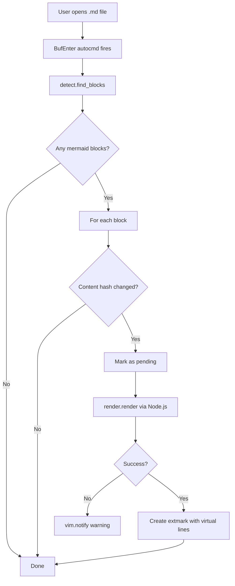
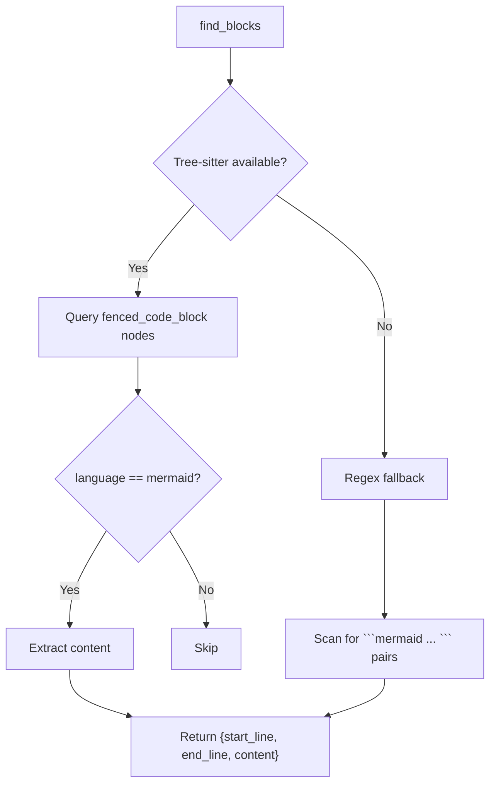
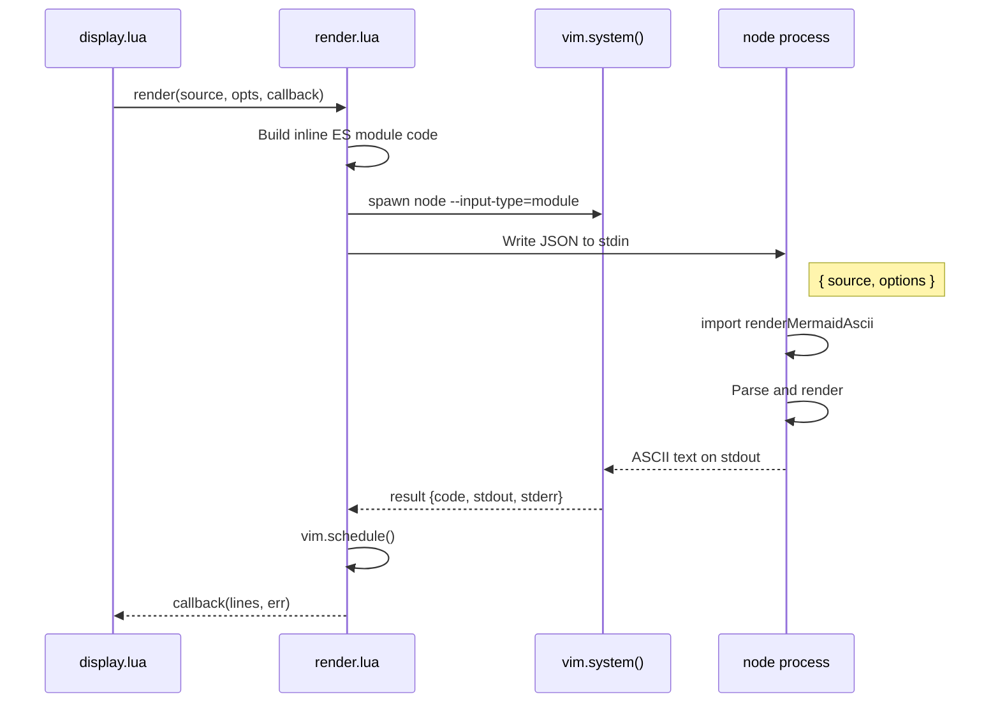
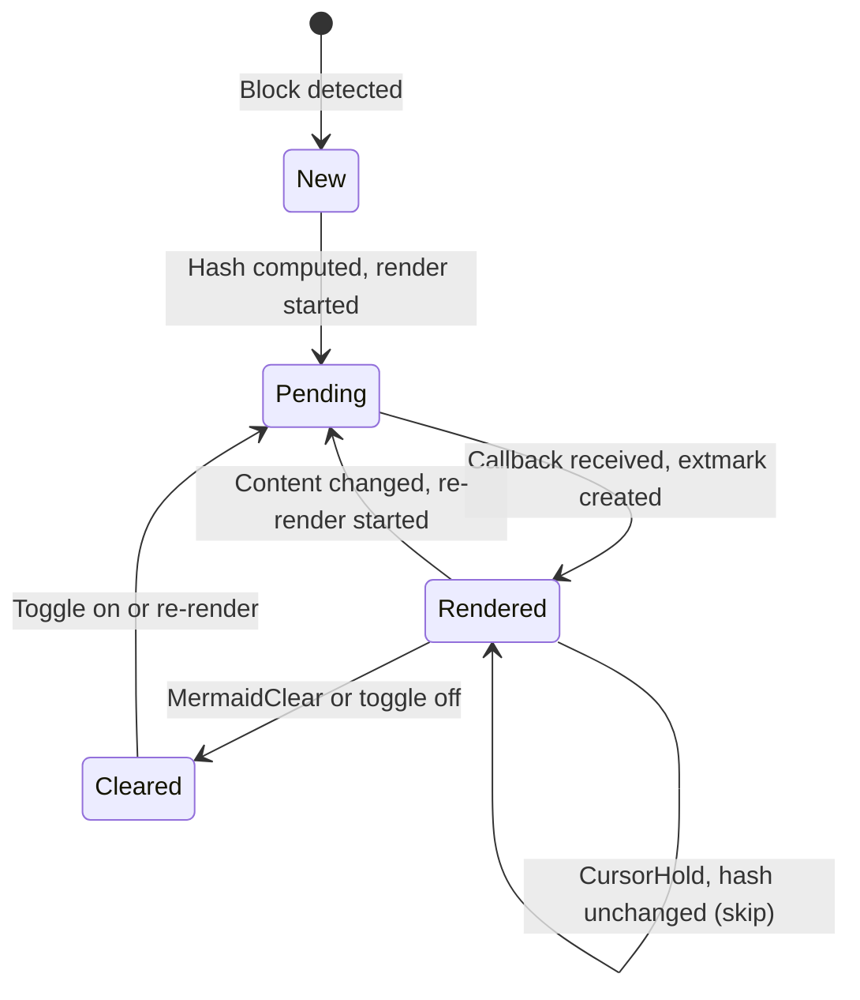
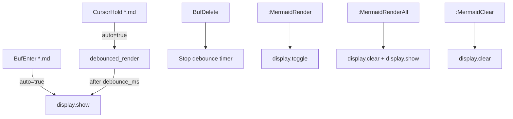

# Neovim Plugin

The Neovim plugin detects Mermaid code blocks in Markdown files and renders them as inline ASCII art using virtual text (extmarks). It handles detection, async rendering, caching, and display lifecycle.

## Plugin Lifecycle



## Detection (`detect.lua`)

The plugin finds mermaid code blocks using two strategies:



**Tree-sitter** (preferred): Uses the markdown tree-sitter parser to query for `fenced_code_block` nodes with a `language` of `"mermaid"`. This is robust against edge cases like nested code blocks.

**Regex fallback**: Scans buffer lines for `` ```mermaid `` opening fences and matching `` ``` `` closing fences. Used when tree-sitter is unavailable.

Both return 0-indexed line ranges with the block content.

## Async Rendering (`render.lua`)

Rendering is fully async to avoid blocking the editor.



The Node.js process receives JSON on stdin (`{ source, options }`) and writes the rendered ASCII text to stdout. The inline ES module imports `renderMermaidAscii` directly from `ts/dist/index.js`.

`vim.schedule()` is used to marshal the callback back to the main Neovim event loop, since `vim.system()` callbacks run on a libuv thread.

## Display Management (`display.lua`)

### Content Hashing

Every block's content is hashed (simple polynomial hash). When a `CursorHold` event triggers a re-render cycle, unchanged blocks are skipped entirely:



### Extmark Placement

Virtual text is placed **below** each code block's closing fence using Neovim extmarks:

```
```mermaid             ← start_line (0-indexed)
graph TD
  A --> B
```                    ← end_line (extmark anchor)
                       ← empty virtual line
  ┌───┐                ← virtual text lines
  │ A │                   (2-space indent, Comment highlight)
  └─┬─┘
    │
    ▼
  ┌───┐
  │ B │
  └───┘
                       ← empty virtual line
```

Each virtual line is styled with the `Comment` highlight group (typically gray/muted). A blank line is added above and below the diagram for visual separation.

### State Tracking

The `rendered` table tracks per-buffer, per-block state:

```
rendered[bufnr][start_line] = {
  id      = extmark_id,   -- nil while pending
  hash    = content_hash, -- for change detection
  pending = true/false,   -- prevents duplicate async renders
}
```

This prevents:
- **Duplicate renders** -- if a block is already pending, new render requests for the same content are skipped
- **Stale callbacks** -- if content changes while a render is in-flight, the old callback's result is discarded (hash mismatch check)

## Autocmd Flow



The `CursorHold` autocmd is debounced to avoid excessive re-renders while the user is actively editing. The debounce timer is cleaned up when the buffer is deleted.
