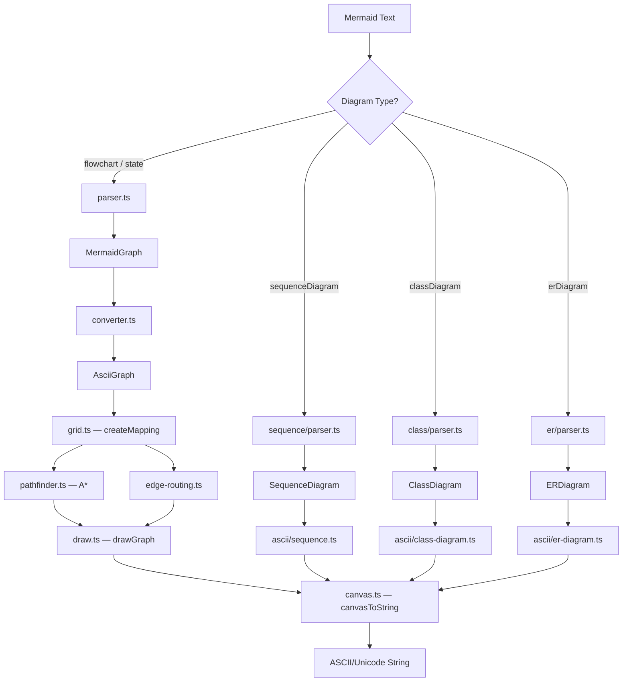
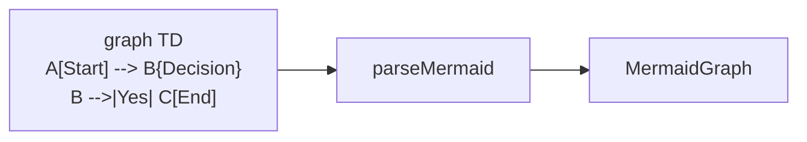
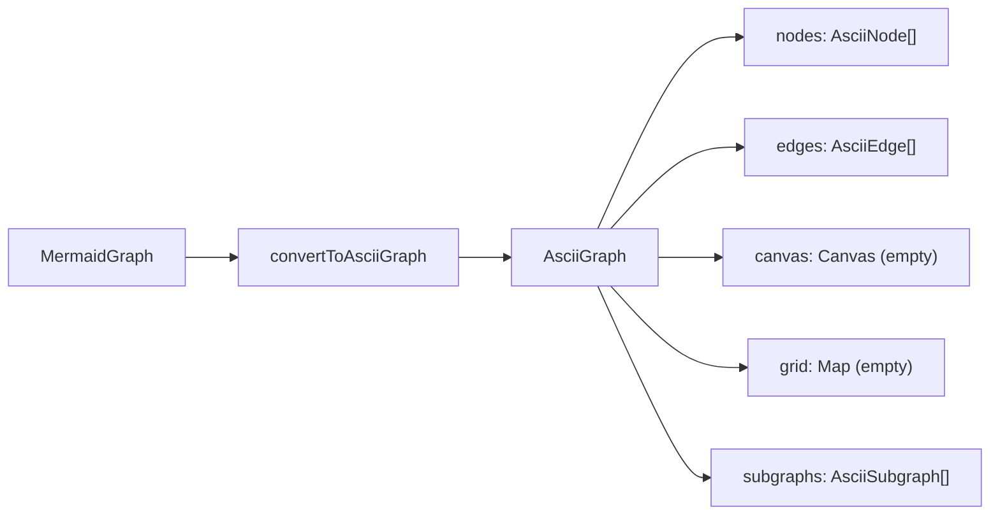
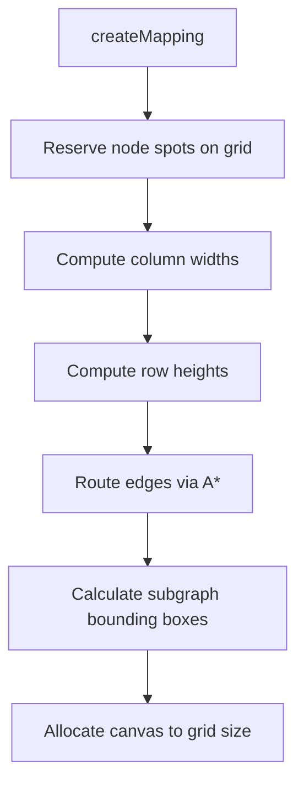
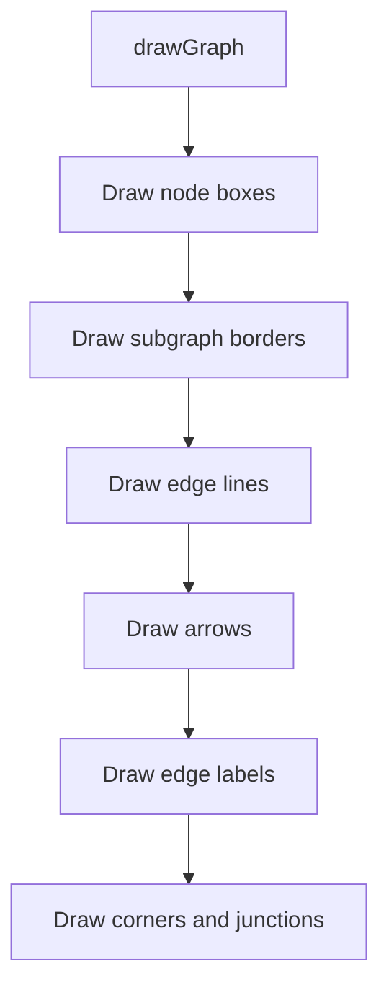
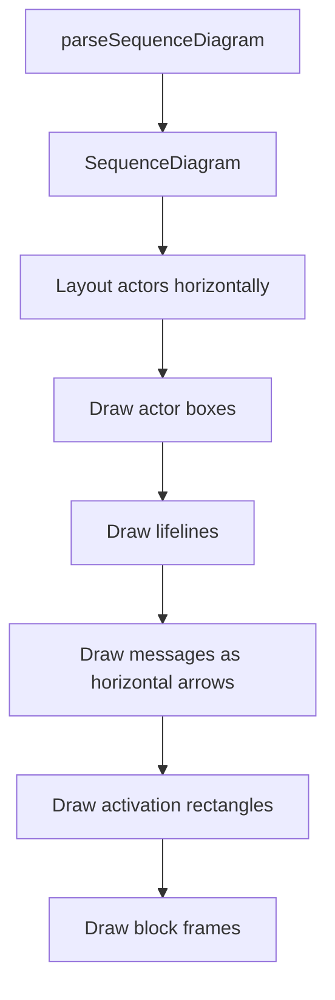
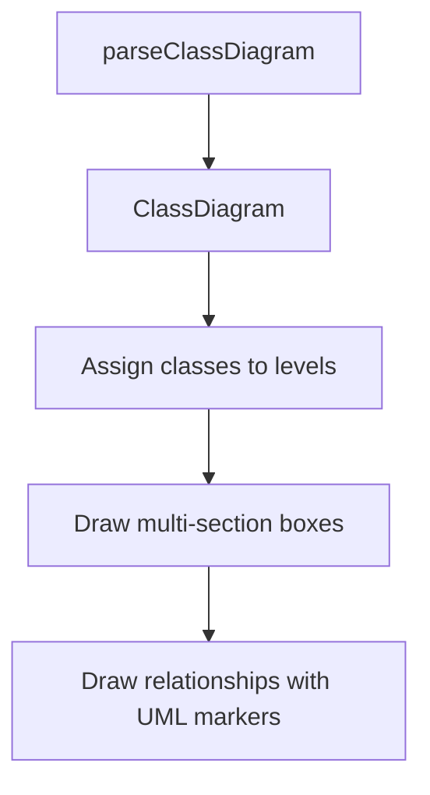
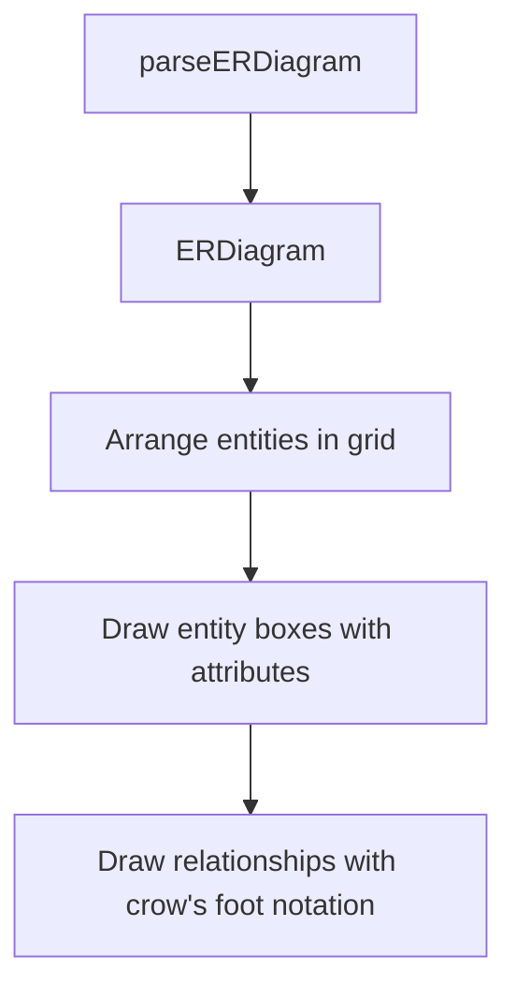

# Rendering Pipeline

The TypeScript engine transforms Mermaid text into ASCII/Unicode art through a multi-stage pipeline. Flowcharts and state diagrams share a common grid-based pipeline, while sequence, class, and ER diagrams each have self-contained renderers.

## Pipeline Overview



## Flowchart & State Diagram Pipeline

This is the main pipeline -- the most complex one. It uses a grid-based coordinate system with A* pathfinding for edge routing.

### Stage 1: Parse

`parser.ts` performs line-by-line regex parsing. No grammar generator is used.



The parser extracts:
- **Direction** from the header (`TD`, `LR`, `BT`, `RL`)
- **Nodes** with ID, label, and shape (13 shape types supported)
- **Edges** with source, target, label, style, and arrow direction
- **Subgraphs** with nesting, labels, and optional direction overrides
- **Style definitions** (`classDef`, `style`, `:::` shorthand)

Supported edge syntax includes chaining (`A --> B --> C`), parallel edges (`A & B --> C & D`), and bidirectional arrows (`A <--> B`).

### Stage 2: Convert

`ascii/converter.ts` maps the parsed `MermaidGraph` into an `AsciiGraph` -- the internal representation used by the grid layout engine.



Key conversion steps:
- Maps `MermaidNode` to `AsciiNode` (grid coords not yet assigned)
- Maps `MermaidEdge` to `AsciiEdge` (paths not yet routed)
- Resolves class definitions and inline styles onto nodes
- Deduplicates subgraph membership (nodes belong only to the subgraph where first referenced)

### Stage 3: Layout

`ascii/grid.ts` is the layout orchestrator. It places nodes on a logical grid, computes column/row sizes, and routes edges.



**Node placement:** Each node claims a 3x3 block on the logical grid. If a cell is already occupied, the node shifts perpendicular to the flow direction until it finds free space.

**Column/row sizing:** Each node contributes to three columns and three rows (its 3x3 block). The middle column width is determined by `2 * padding + labelLength`. The middle row height is `1 + 2 * padding`.

**Edge routing:** For each edge, `edge-routing.ts` determines the best start and end attachment points on the source and target nodes. Then `pathfinder.ts` runs A* to find the shortest path on the grid, avoiding occupied cells. The heuristic is Manhattan distance with a corner penalty to prefer straight lines.

**Subgraph bounding boxes:** Computed recursively from contained nodes, with padding for borders and labels.

### Stage 4: Draw

`ascii/draw.ts` renders everything onto the 2D canvas in layered order.



Each node is first rendered to its own standalone `Canvas` via `drawBox()`, then merged onto the main canvas at the correct drawing coordinates. This allows nodes to be rendered independently before compositing.

Edge drawing traces the A* path on the canvas, placing line characters (`─`, `│` or `-`, `|`), arrow characters (`▶`, `▼`, `◀`, `▲` or `>`, `v`, `<`, `^`), and corner characters (`┌`, `┐`, `└`, `┘` or `+`).

### Stage 5: Output

`ascii/canvas.ts` converts the 2D character array to a multi-line string, trimming trailing whitespace from each line.

## Direction Handling

The engine normalizes `BT` (bottom-to-top) by:
1. Laying out as `TD` (top-to-down)
2. Drawing everything normally
3. Flipping the entire canvas vertically
4. Remapping directional characters: `▲↔▼`, `◁↔▷`, `┌↔└`, `┐↔┘`

`LR` and `RL` are handled natively by the grid system -- nodes are placed left-to-right or right-to-left, and edge routing adapts accordingly.

## Canvas System

The canvas is a **column-major 2D array**: `canvas[x][y]` gives the character at column `x`, row `y`.

```
canvas[0][0]  canvas[1][0]  canvas[2][0]  ...
canvas[0][1]  canvas[1][1]  canvas[2][1]  ...
canvas[0][2]  canvas[1][2]  canvas[2][2]  ...
...
```

**Junction merging** is critical when edges cross or meet box borders. When a box-drawing character is placed on a cell that already contains another box-drawing character, the canvas resolves them to the correct combined junction:

| Overlap | Result |
|---|---|
| `─` + `│` | `┼` |
| `─` + `┌` | `┬` |
| `│` + `└` | `├` |
| etc. | Lookup table in `canvas.ts` |

## Sequence Diagram Renderer

Self-contained in `ascii/sequence.ts`. Uses a column-based timeline layout:



Actors are spaced across the top. Vertical dashed lifelines extend downward. Messages are horizontal arrows between lifelines with labels above. Blocks (loop, alt, opt, par, critical, break) wrap around message groups with labeled borders.

## Class Diagram Renderer

Self-contained in `ascii/class-diagram.ts`. Uses level-based top-down layout:



Classes are placed in layers based on inheritance hierarchy. Each class renders as a three-section box (name | attributes | methods). Relationships use UML notation: hollow triangles for inheritance, filled diamonds for composition, hollow diamonds for aggregation.

## ER Diagram Renderer

Self-contained in `ascii/er-diagram.ts`. Uses a grid layout:



Entities are placed in a grid pattern that wraps to multiple rows. Each entity is a two-section box (name | attributes). Relationships use crow's foot cardinality markers (`║`, `╟`, `o║`, `o╟`).
