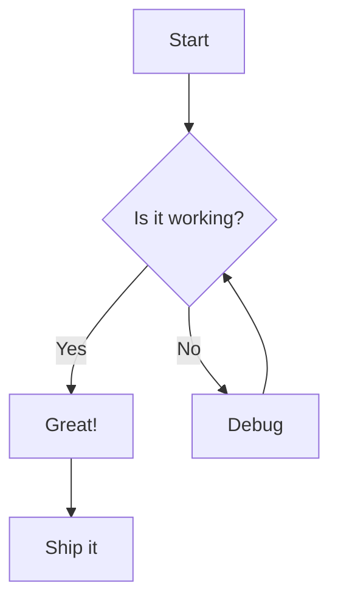
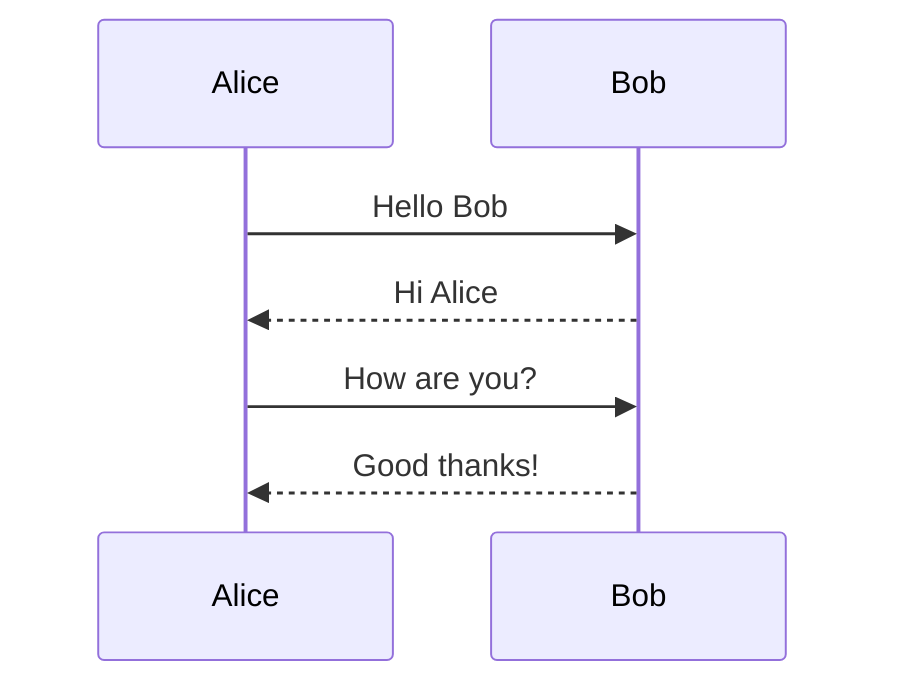
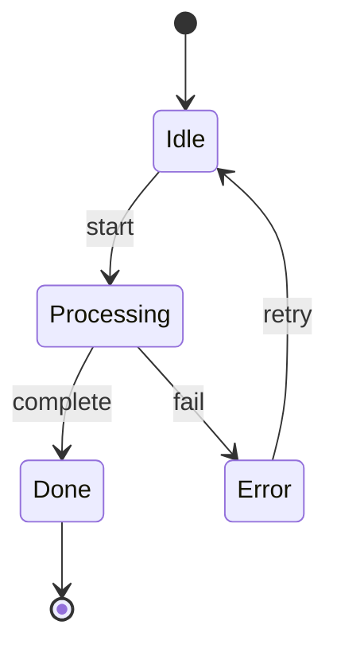
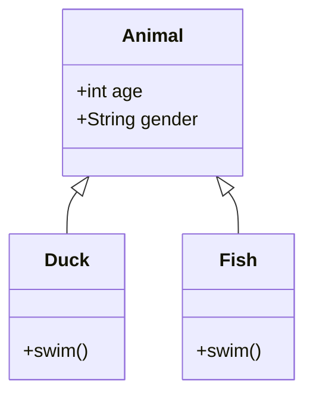

#:lua require("ascii-mermaid").setup() ASCII Mermaid Test

## Flowchart

```mermaid
graph TD
    A[Start] --> B{Is it working?}
    B -->|Yes| C[Great!]
    B -->|No| D[Debug]
    D --> B
    C --> E[Ship it]
```

## Sequence Diagram

```mermaid
sequenceDiagram
    Alice->>Bob: Hello Bob
    Bob-->>Alice: Hi Alice
    Alice->>Bob: How are you?
    Bob-->>Alice: Good thanks!
```

## State Diagram

```mermaid
stateDiagram-v2
    [*] --> Idle
    Idle --> Processing: start
    Processing --> Done: complete
    Processing --> Error: fail
    Error --> Idle: retry
    Done --> [*]
```

Some text between diagrams to make sure detection works.

## Class Diagram

```mermaid
classDiagram
    Animal <|-- Duck
    Animal <|-- Fish
    Animal: +int age
    Animal: +String gender
    Duck: +swim()
    Fish: +swim()
```
